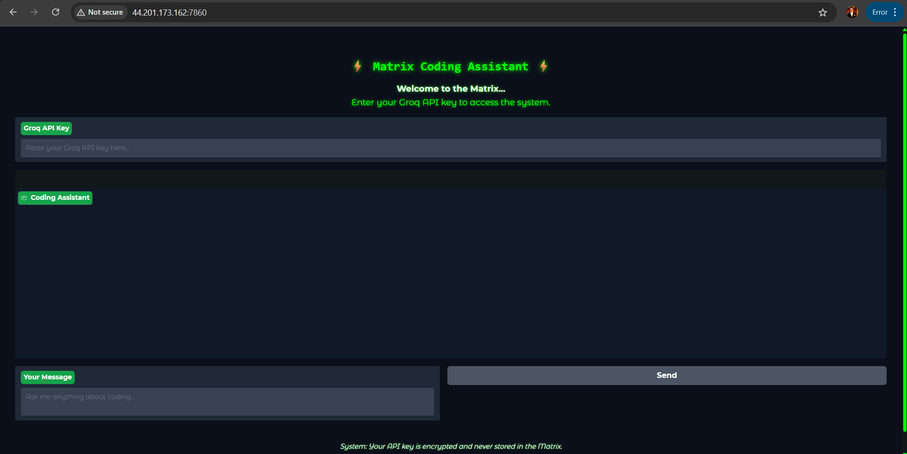
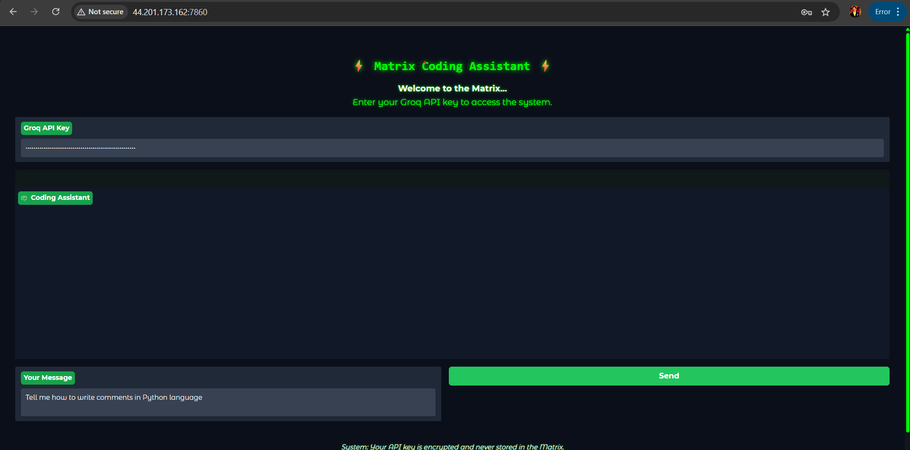
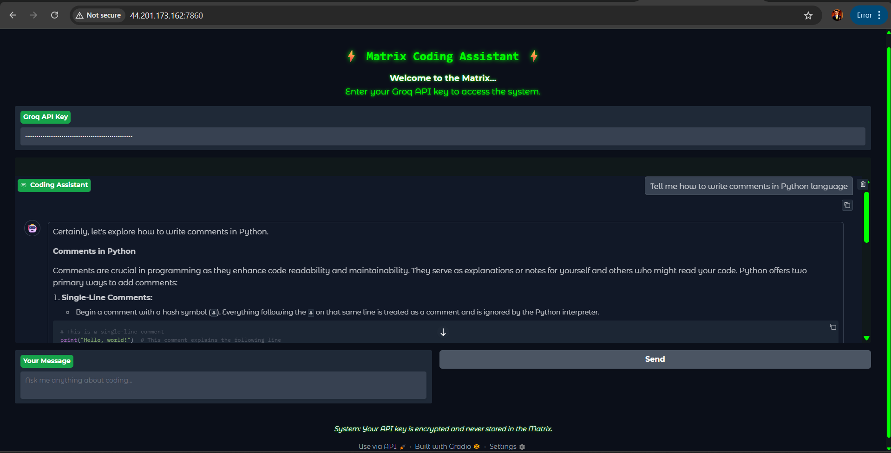

# Coding Assistant

A coding assistant powered by [LangChain](https://python.langchain.com/) and [Groq](https://groq.com/), with a modern Gradio UI. This assistant helps you with coding questions, code generation, and detailed explanations.

---

## ✨ Features
- **Conversational Coding Assistant**: Ask questions, get code, and receive step-by-step explanations.
- **Powered by Groq LLMs**: Uses the latest Groq models via LangChain.
- **Modern Gradio UI**: Clean, green-accented interface.
- **Frontend API Key Input**: Your Groq API key is entered securely in the browser and never stored.

---

## 🚀 Quickstart (Local)

### 1. Clone the Repository
```bash
# Download or clone this repository
cd path/to/your/folder
```

### 2. Install Requirements
```bash
pip install -r requirements.txt
```

### 3. Get a Groq API Key
- Sign up at [groq.com](https://groq.com/) and generate your API key from the dashboard.

### 4. Run the App
```bash
python app.py
```

- The app will open in your browser. Enter your Groq API key in the UI and start chatting!

---

## 🛠️ Usage
- **Enter your Groq API key** in the provided field.
- **Type your coding question** or request in the chat box.
- **Receive detailed, well-commented code and explanations** from the assistant.

---

## 📦 Requirements
- Python 3.8+
- See `requirements.txt` for all dependencies.

---

## 🌐 Deploying to AWS EC2 (Step-by-Step Guide)

### 1. **Create an AWS Account**
- Sign up at [aws.amazon.com](https://aws.amazon.com/).

### 2. **Set Up an IAM User (Best Practice)**
- Go to the **IAM** section in the AWS Console.
- Create a new user (e.g., `ec2-admin`) with **programmatic access** and **console access**.
- Attach the policy: `AmazonEC2FullAccess` (for learning; for production, use least privilege).
- Download the credentials (Access Key ID and Secret).

### 3. **Launch an EC2 Instance**
- Go to EC2 Dashboard → “Instances” → “Launch Instance”.
- **Name:** e.g., `coding-assistant`
- **AMI:** Ubuntu Server 22.04 LTS
- **Instance Type:** t3.micro (free tier/low cost) or t3.small for more RAM
- **Key Pair:** Create/download a new key pair (RSA)
- **Network Settings:**
  - Allow SSH (port 22) from your IP only
  - Add a custom TCP rule for **port 7860** (Gradio default) open to your IP (or 0.0.0.0/0 for public, but restrict for security)
- **Storage:** 8GB is enough for most apps
- **Launch Instance**

### 4. **Connect to Your EC2 Instance**
```sh
chmod 400 /path/to/your-key.pem
ssh -i /path/to/your-key.pem ubuntu@<EC2-PUBLIC-IP>
```

### 5. **Update and Install Dependencies**
```sh
sudo apt update && sudo apt upgrade -y
sudo apt install python3-pip python3-venv -y
```

### 6. **Upload Your App Files**
- **Option 1:** Use `scp` to copy files from your local machine:
  ```sh
  scp -i /path/to/your-key.pem -r /path/to/your/project ubuntu@<EC2-PUBLIC-IP>:~/
  ```
- **Option 2:** Clone from GitHub:
  ```sh
  sudo apt install git -y
  git clone <your-repo-url>
  cd <your-repo-folder>
  ```

### 7. **Set Up a Python Virtual Environment**
```sh
python3 -m venv venv
source venv/bin/activate
pip install --upgrade pip
pip install -r requirements.txt
```

### 8. **Run Your App**
```sh
python app.py
```
- By default, Gradio will run on port 7860 and listen on all interfaces (see `app.py`).
- Access it in your browser: `http://<EC2-PUBLIC-IP>:7860`

### 9. **Security & Cost Best Practices**
- **IAM:** Use IAM users, not root. Remove unused users/keys.
- **Security Groups:** Only open necessary ports (22 for SSH, 7860 for Gradio, restrict by IP if possible).
- **Instance Type:** Use t3.micro or t3.small for low cost.
- **Stop Instance:** When not in use, stop (not terminate) your instance to avoid charges.
- **Monitor Usage:** Use AWS Budgets to set alerts for spending.

### 10. **Clean Up**
- When done, **stop or terminate** your EC2 instance to avoid ongoing charges.

---

### 11. **Screenshots**

Below are some screenshots of the app in action:

#### App Home Page


#### Chat Interface Example


#### AWS EC2 Instance Running


---

## 📝 Notes
- Your API key is only used in your browser session and is never stored or sent to any server except Groq.
- The UI features a green-accented, modern theme.

---

## 🤝 Credits
- [LangChain](https://python.langchain.com/)
- [Groq](https://groq.com/)
- [Gradio](https://gradio.app/)

---

## 📄 License
MIT License 
